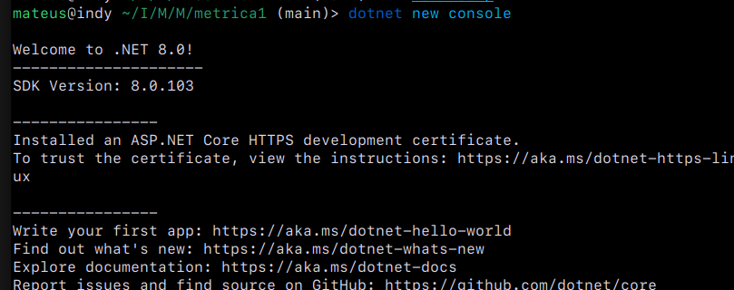
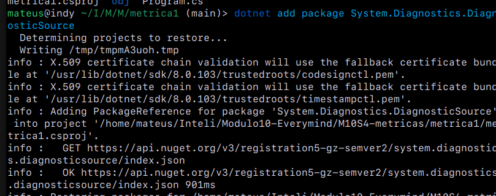
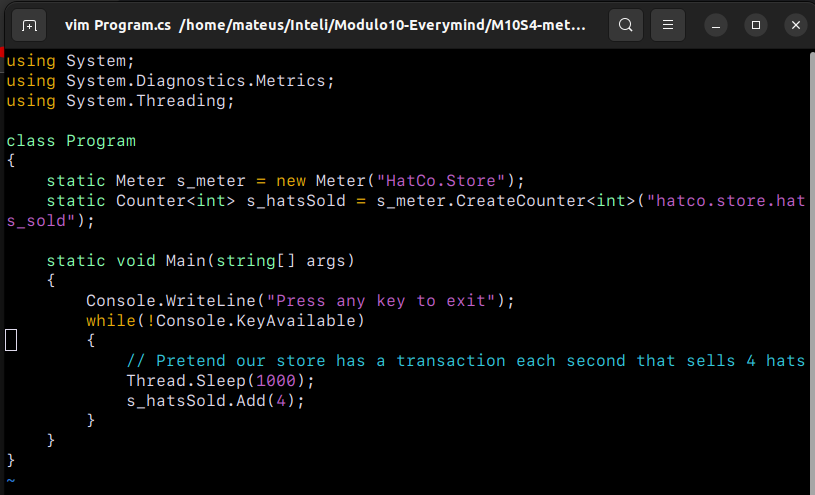
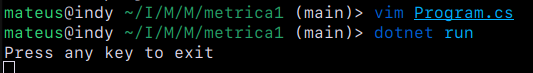
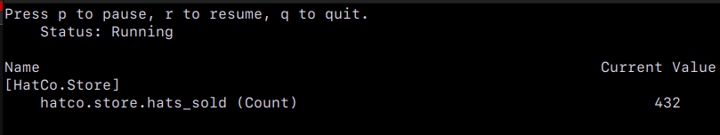
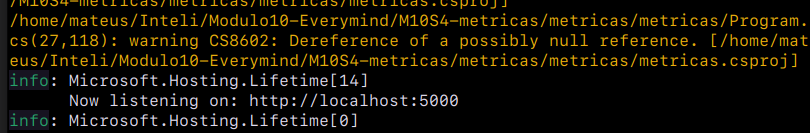
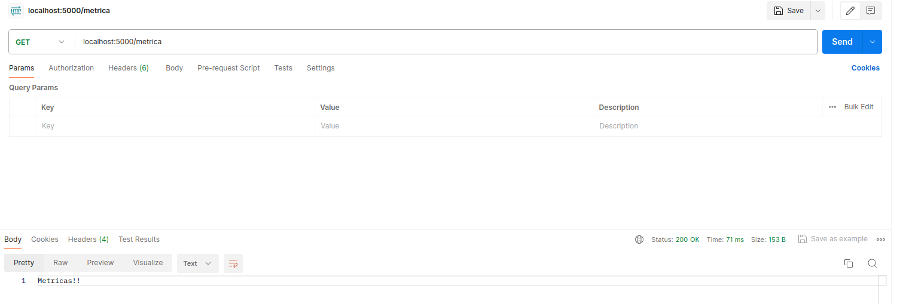

# Ponderada Criando métricas

## pré requisito

- dot net 8
- jetbrains rider
- dotnet-counters

### Para instalar o dotnet-counters:
``` dotnet tool install --global dotnet-counters ```

## Criar uma métrica personalizada

### Criando um projeto utilizando o:
``` dotnet new console ```



### Instalando o pacote  NuGet System.Diagnostics.DiagnosticSource:



### Atualizando o Program.cs:



### Rodando o Projeto:



### Coletando as métricas:




##  Obtenha um Medidor por meio da injeção de dependência

### Rodando o projeto com as mudanças para API:



### Testando a API utilizando o Postman:


